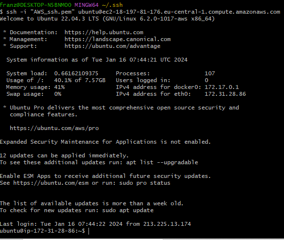

# Project Version Control Guidelines

1. [Branches](#branches)
2. [Development Strategy](#development-strategy)
3. [Contributing to Repository Project](#contributing-to-repository-project)
4. [Push Policy](#push-policy)
5. [Workflow Scripts](#workflow-scripts)
    - [new_release.yml](#new_releaseyml)
    - [feature_progress.yml](#feature_progressyml)
    - [commit_hotfix.yml](#commit_hotfixyml)
6. [Maintenance](#maintenance)
    - [Jobs](#jobs)
    - [Actions](#actions)
        - [actions/checkout@v4](#actionscheckoutv4)
        - [actions/setup-java@v4](#actionssetup-javav4)
        - [actions/upload-artifact@master](#actionsupload-artifactmaster)
        - [actions/download-artifact@master](#actionsdownload-artifactmaster)
        - [Ilshidur/action-discord@master](#ilshiduraction-discordmaster)
        - [mr-smithers-excellent/docker-build-push@v6](#mr-smithers-excellentdocker-build-pushv6)
7. [AWS](#aws)

## Branches

- `main`: Main branch for linear commit history and releases.
- `dev`: Production branch with latest working code.
- `feature/*`: Sandbox for ongoing development.
- `hotfix/*`: One time commit branch for short call solutions.

## Development Strategy

- `feature/*` branch is allowed to fail.
- `dev` branch should not fail.
- `hotfix/*` branch must not fail.
- `main` branch must not fail.

## Contributing to Repository Project

- Create `hotfix/<NAME>` from `main` 
  - `hotfix/<NAME>` will be deleted from `origin` after pull-request
  - `dev` will be updated if tests succeed
  - `main` gets a merge request to support double-checking
- Create `feature/<NAME>` from `dev`
  - `feature/<NAME>` will be updated regardless of any tests
  - `dev` will be updated if tests succeed
  - `main` gets a merge request to support double-checking

## Push Policy

Pushing code without tests is generally not allowed in this system

1. Commit code with short and direct description \
   
2. Change to Pull Request Tab \
   
3. Create Pull Request with the same description of the commit \
   
4. Once the Checks are done the Changes are taken into effect in the dev branch.

### Workflow Scripts

#### new_release.yml

##### How to Use

1. Manually trigger `new_release.yml`, the `version number` is mandatory and to put in manually to avoid misunderstandings.

##### Trigger

`new_release.yml` is triggered manually by using the "workflow_dispatch" event.

##### Inputs

- **Version**: Version number for the release (required).

#### feature_progress.yml

##### How to Use

The developer works on a branch names `feature/*`
All delevopers writing new features for the project need to use `feature progress.yml`.

##### Triggers

- **Pushes**: Triggered on every push to branches starting with 'feature/'.
- **Pull Requests**: Triggered when a pull request is opened or updated on branches starting with 'feature/'.

#### commit_hotfix.yml

##### How to Use

The developer works on a branch names `hotfix/*`
If the deployed version of this project needs a hotfix, the developers need to use `commit_hotfix.yml`.

##### Triggers

- **Pushes**: Triggered on every push to branches starting with 'hotfix/'.
- **Pull Requests**: Triggered when a pull request is opened or updated on branches starting with 'hotfix/'.

## Maintenance

### Jobs

#### build:
The job `build` creates an executable file from source code. It creates a directory `resources/build` in the Volume.
The `build` files are uploaded as artifact.

#### test:
The job `test` downloads the `build` from the volume. Runs unit tests and then integration tests.\
ATTENTION: If the integration tests start to change the database, we need to implement deeper test strategies.

#### lint:
The job `lint` runs a `klint` code compliance test. Gives also an error for wrong spacings.

#### sync-branch:
The job `sync-branch` runs if `test` is successful. `sync-branch` executes raw git commands with a `github-token` to merge functioning changes into branch `dev`.

#### cleanup:
The job `cleanup` deletes the branch after a successful workflow. `cleanup` executes raw git commands.

#### build_docker_image:
The job `build_docker_image` uses [mr-smithers-excellent/docker-build-push@v6](#mr-smithers-excellentdocker-build-pushv6) to deploy a working `docker image`.
The `docker image` uses the `tags` from `input` and `latest`.
The `docker image` is saved as artifact to the volume.

#### deploy_docker_image:
The job `deploy_docker_image` downloads the `docker-image` from volume and establishes a `SSH` connection to `AWS`.
With the `SSH` connection it deploys the `image` as a `live container`

#### naughtyfication:
The job `naughtyfication` (bun intended) uses a `webhook` to announce a new live version in the `Dev Chat`.


### Actions

#### actions/checkout@v4
[Link to the repo of checkout](https://github.com/marketplace/actions/checkout)

This action checks out the repository, so the workflow can access it. By default only a single commit is fetched. The auth token is persisted in the local git config.
This enables the scripts to run authenticated git commands.\
Need to run at first to have access to resources.


#### actions/setup-java@v4
[Link to the repo of setup-java](https://github.com/marketplace/actions/setup-java-jdk)

This action installs a JDK environment on the job container.\
Need to run before executing java executables


#### actions/upload-artifact@master
[Link to the repo of upload-artifact@master](https://github.com/marketplace/actions/upload-a-build-artifact)

This action uploads the artifact. The artifact allows you to persist data after a job has completed, and shar that data with another job in the same workflow.


#### actions/download-artifact@master
[Link to the repo of download-artifact](https://github.com/marketplace/actions/artifact-downloader)

This action downloads the artifact so the artifact can be used in different actions of your workflows.


#### Ilshidur/action-discord@master
[Link to the repo of Ilshidur/action-discord@master](https://github.com/marketplace/actions/actions-for-discord)

Sends a discord notification message.

#### mr-smithers-excellent/docker-build-push@v6
[Link to the repo of Ilshidur/action-discord@master](https://github.com/marketplace/actions/docker-build-push-action)

Builds a Docker image and pushes it to the private registry of your choosing.

## AWS
[Link to the official documentation](https://docs.aws.amazon.com/efs/latest/ug/gs-step-one-create-ec2-resources.html)

1. Create an account for AWS
2. When your EC2 instance is up and running connect to it with the command line

When you are connected it should look something like that:



Now to install docker first of all run

````
sudo apt update
````

to update everything that is already on your instance installed. Now run the following commands:

````
sudo apt-get install \
    apt-transport-https \
    ca-certificates \
    curl \
    gnupg-agent \
    software-properties-common
````

````
curl -fsSl https://download.docker.com/linux/ubuntu/gpg | sudo apt-key add -
````

````
sudo apt-get install docker-ce docker-ce-cli containerd.io
````

````
apt-cache madison docker-ce
sudo apt-get install docker-ce docker-ce-cli containerd.io
````

````
sudo apt install docker.io
sudo apt install docker-compose
````

I took these commands from the following YouTube video:

[Link to the video](https://www.youtube.com/watch?v=awFLzy0XwXo)
