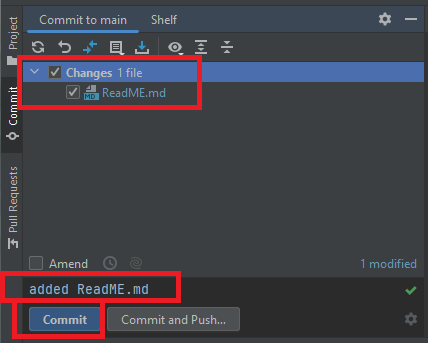
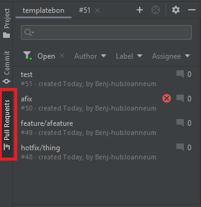
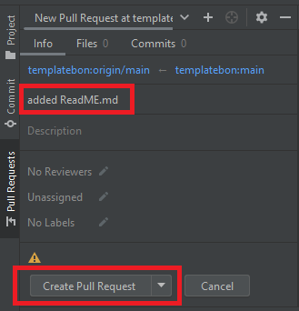

# Project Version Control Guidelines

1. [Branches](#branches)
2. [Development Strategy](#development-strategy)
3. [Contributing to Repository](#contributing-to-repository)
4. [Push Policy](#push-policy)
5. [Workflow Files](#workflow-files)
   - [new_release.yml](#new_releaseyml)
      - [How to Use](#how-to-use)
      - [Trigger](#trigger)
      - [Inputs](#inputs)
      - [Environment Variables](#environment-variables)
      - [Workflow Steps](#workflow-steps)
   - [feature_progress.yml](#feature_progressyml)
      - [How to Use](#how-to-use-1)
      - [Triggers](#triggers)
      - [Environment Variables](#environment-variables-1)
      - [Workflow Steps](#workflow-steps-1)
   - [commit_hotfix.yml](#commit_hotfixyml)
      - [How to Use](#how-to-use-2)
      - [Triggers](#triggers-1)
      - [Environment Variables](#environment-variables-2)
      - [Workflow Steps](#workflow-steps-2)

## Branches

- `main`: Main branch for linear commit history and releases.
- `dev`: Developer branch for ongoing updates.

## Development Strategy

- `feature` branch is allowed to fail.
- `dev` branch should not fail.
- `main` branch must not fail.

## Contributing to Repository

- Create `hotfix/<NAME>` from `main` to update both `main` and `dev`.
- Create `feature/<NAME>` from `dev` to add new features.

## Push Policy

Pushing code without tests is generally not allowed in this organisation

1. Commit code with short and direct description \
   
2. Change to Pull Request Tab\
   
3. Create Pull Request with the same description of the commit \
   
4. Once the Checks are done the Changes are taken into effect in the dev branch.

### workflow files

#### new_release.yml

##### How to Use

1. Manually trigger the workflow, the version number is mandatory and to put in manually.

Note: a manual input ensures a double check of actions

##### Trigger

The workflow is triggered manually by using the "workflow_dispatch" event, allowing you to provide the desired version number for the release.

##### Inputs

- **Version**: Version number for the release (required).

##### Environment Variables

- **GIT_USER_EMAIL**: git email from user
- **GIT_USER_NAME**: git username from user
- **DOCKER_IMAGE_NAME**: name of docker image
- **DOCKER_IMAGE_TAGS**: version taf of docker image
- **DOCKER_REGISTRY**: storage hub for docker images
- **DISCORD_WEBHOOK**: Discord webhook for release notifications.
- **DOCKER_USERNAME**: Docker username from user
- **DOCKER_PASSWORD**: Docker password from user

## Workflow Steps

1. **Set Git identity**: Configures Git with the provided email and username.
2. **Checkout code**: Checks out the repository code.
3. **Set up JDK 17**: Configures the Java Development Kit (JDK) version 17.
4. **Grant execute permission for gradlew**: Allows the Gradle wrapper script to be executed.
5. **Build with Gradle**: Builds the project using Gradle.
6. **Run Unit Tests**: Executes unit tests for the project.
7. **Run Integration Tests**: Executes integration tests for the project.
8. **Build & push Docker image**: Builds the Docker image and pushes it to the specified registry.
9. **Discord notification**: Sends a notification to Discord indicating the availability of the new release.

#### feature_progress.yml

##### How to Use

This workflow, named `feature progress`, is designed to handle pushes and pull requests on branches for new features.

##### Triggers

- **Pushes**: Triggered on every push to branches starting with 'feature/'.
- **Pull Requests**: Triggered when a pull request is opened or updated on branches starting with 'feature/'.

##### Environment Variables

- **GIT_USER_EMAIL**: Email for Git actions.
- **GIT_USER_NAME**: Username for Git actions.

##### Workflow Steps

1. **Set Git Identity**: Configures Git with the provided email and username for the workflow.
2. **Checkout Code**: Checks out the repository code with a fetch depth of 0.
3. **Set up JDK 17**: Configures the Java Development Kit (JDK) version 17.
4. **Grant Execute Permission for Gradlew**: Allows the Gradle wrapper script to be executed.
5. **Build with Gradle**: Builds the project using Gradle.
6. **Run Unit Tests**: Executes unit tests for the project.
7. **Run Integration Tests**: Executes integration tests for the project.
8. **Extract Branch Name**: Retrieves the current branch name from the environment.
9. **Merge Feature into dev**: Merge changes into dev
10. **Run Ktlint Checks**:

#### commit_hotfix.yml

##### How to Use

This workflow is triggered when a pull request from 'hotfix/*' starts.

##### Triggers

- **Pushes**: Triggered on every push to branches starting with 'hotfix/'.
- **Pull Requests**: Triggered when a pull request is opened or updated on branches starting with 'hotfix/'.

##### Environment Variables

- **GIT_USER_EMAIL**: Email for Git actions.
- **GIT_USER_NAME**: Username for Git actions.

##### Workflow Steps

1. **Set Git Identity**: Configures Git with the provided email and username for the workflow.
2. **Checkout Code**: Checks out the repository code with a fetch depth of 0.
3. **Set up JDK 17**: Configures the Java Development Kit (JDK) version 17.
4. **Grant Execute Permission for Gradlew**: Allows the Gradle wrapper script to be executed.
5. **Build with Gradle**: Builds the project using Gradle.
6. **Run Unit Tests**: Executes unit tests for the project.
7. **Run Integration Tests**: Executes integration tests for the project.
8. **Extract Branch Name**: Retrieves the current branch name from the environment.
9. **Merge Hotfix into Dev**: Merges the hotfix branch into the 'dev' branch using fast-forward-only mode.
10. **Delete Hotfix Branch**: Deletes the hotfix branch after a successful merge.
